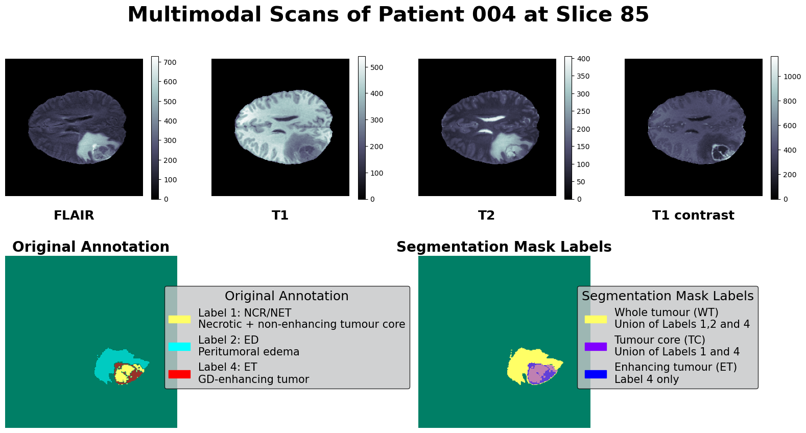

# 3D Brain Tumour Segmentation Project

### By Bryan Tan (Chen Zhengyu), Christy Lau Jin Yun and Lee Pei Xuan

## Abstract

There is a need for automated approaches to brain-tumour segmentation as it can help reduce hospital workloads and save lives. Existing models that have proven to be suitable for the problem of tumour segmentation include 3D-UNet and Swin UNETR. Using the BraTS2020 dataset, we test several approaches for brain tumour segmentation such as developing novel models we call 3D-ONet and 3D-SphereNet, our own variant of 3D-UNet with more than one encoder-decoder paths. We aim to maximise performance (defined as high dice and jaccard scores) while minimising parameter count. We trained each model from scratch for 50 epochs using BCE-Dice Loss as the objective and evaluated them by their dice and jaccard score. We found that the performance of our proposed 3D-Onet exceeds that of NVIDIA's Swin UNETR (a model considered state-of-the-art) in data and resource-constrained environments while being much more parameter efficient. However, more work is needed to validate its performance, especially under data and resource-abundant conditions.

## Setup Environment

**Device specifications**: Training and evaluation are performed with an Intel i5-13600k, 32GB of RAM and an RTX 3090 with 24GB VRAM on Ubuntu-22.04 via WSL.

1. Clone [this repository](https://github.com/Inc0mple/3D_Brain_Tumor_Seg_V2.git).

2. Download this [BraTS2020 dataset](https://www.kaggle.com/datasets/overspleen/brats-2020-fixed-355) from Kaggle into the repository folder.

3. Run the following commands on a terminal:

```
# Set up Python virtual environment

python -m venv venv && source venv/bin/activate

# Make sure PIP is up to date

pip install -U pip wheel setuptools

# Install required dependencies

pip install -r requirements.txt

```

### Important Notebooks (In order of recommended exploration)

1. **`VizData_Notebook.ipynb`** contains visualisations of the input channels, original annotations and processed segmentation masks for slices of samples in the BraTS dataset.

2. **`Train_Notebook.ipynb`** contains the code necessary to train a model and save the training logs to the `./Logs` folder.

3. **`VizEval_Single_Notebook.ipynb`** contains the code necessary to evaluate and visualise the predictions of a single model.

4. **`VizEval_Notebook.ipynb`** contains the code necessary to evaluate all models and save the results to the `./results` folder and the models' respective `./Logs` folders.

### Other files and folders (In order of recommended exploration)

- **`./results`** contain aggregate statistics/visualisations for all models.

- **`./Logs`** consists of folders containing the training and evaluation logs for each model, as well as sample predictions. It also contains model checkpoints, images of the model structure and the file `trainer_properties.txt` which stores the model definition and tracked losses, among other useful information. The folder is populated by code from `Train_Notebook.ipynb` and `VizEval_Notebook.ipynb`.

- **`./models`** contain `.py` files of PyTorch models which are imported and instantiated for use in `Train_Notebook.ipynb` and `VizEval_Notebook.ipynb.`

- **`./utils`** contain vital functions and classes such as `BratsDataset.py` (the dataset class), `Meter.py` (class for tracking results in the `Trainer` class) as well as other utility functions for visualisation/evaluations.

- **`./Images`** contains miscellaneous images that are used in the README or the report.

- **`fold_data.csv`** is generated by `Train_Notebook.ipynb` and contains the information to map different patients (and their directory paths) to different training/validation/testing folds.


- **`Misc_Visualisations.ipynb`** is a workspace used to generate miscellaneous visualisations which may be included in the final report.

### Training

1. Design/modify your model in the `models` folder and provide the `.py` file with a short but descriptive name.

2. Import and instantiate your model in the 2nd cell of `Train_Notebook.ipynb`

3. In the 3rd cell of `Train_Notebook.ipynb`, assign `"./Log/{your_model_name}"` to `train_logs_path` ; training results will be saved to this folder.

4. Run all cells in `Train_Notebook.ipynb` and wait till training is complete.

### Evaluation

1. To evaluate a single model, run all cells in `VizEval_Single_Notebook.ipynb` and select one of the available models with a number when prompted for user input.

2. To evaluate all models, go to the 4th cell in `VizEval_Notebook.ipynb` and populate `modelDict` with the model names and its corresponding instantiations. The model name should be exactly the same as the name of its folder in `./Logs`. Run all cells in `VizEval_Notebook.ipynb` to populate the results folder with aggregate statistics/visualisations for all models and add additional evaluations/visualisations to the `./Logs` folder.

# Dataset

We utilise the Medical Image Computing and Computer Assisted Interventions (MICCAI) Brain Tumor Segmentation (BraTS 2020) dataset which consists of 369 labelled training samples and 125 unlabelled validation samples of preoperative MRI Brain scans from 19 different institutions. Each sample comprises an image with 240x240x155 voxels saved in the Neuroimaging Informatics Technology Initiative (NIfTI) file format with the file extension \".nii.gz\". For the purpose of training and evaluation, we discard the 125 unlabelled validation samples and split the remaining 369 labelled training samples into train-val-test splits of 263-53-53 (a ratio of approximately 5:1:1).



## Channels

Each sample is comprised of 4 channels/modalities: T1-Weighted (T1), Post-contrast T1-Weighted (T1c), T2-Weighted (T2) and T2 Fluid Attenuated Inversion Recovery (T2-FLAIR). By combining different types of images, doctors gain a more complete picture of a patient's condition and make more informed decisions about treatment.

- **T1-weighted** images are created using specific settings during an MRI scan that highlight differences in the relaxation times of tissues in the body. In medical imaging, T1-weighted images are particularly useful for imaging the brain and other soft tissues.

- **T1c images** are \"contrast-enhanced\", meaning that a contrast agent is used during the scan to make pertinent structures in the brain more visible.

- **T2-weighted** images are characterized by their ability to show the differences in the relaxation times of tissues in the body. T1-weighted images are good at showing details of anatomical structures, while T2-weighted images are useful in detecting abnormalities in fluid-filled spaces and soft tissues.

- **T2-Flair** is similar to T2-weighted imaging in that it uses a magnetic field to highlight differences in tissue relaxation times in the body. However, it also incorporates a technique called fluid-attenuated inversion recovery, which suppresses the signal from cerebrospinal fluid (CSF) in the brain, making it easier to identify abnormalities in adjacent tissues.

## Original Annotations

The original annotations in the dataset comprise the following:

- **Label 1**: Necrotic and non-enhancing tumour core (NCR/NET)

- **Label 2**: Peritumoral edema (ED)

- **Label 4**: GD-enhancing tumor (ET)

## Segmentation Classes

The above regions make up the following segmentation classes considered for evaluation in the BraTS 2020 challenge:

- **Whole tumour (WT)**: Union of NCR/NET, ED and ET (Labels 1,2 and 4).

- **Tumor core (TC)**: Union of NCR/NET and ET (Labels 1 and 4)

- **Enhancing tumour (ET)**: Label 4 only.

## Pre-processing

We perform the following pre-processing steps within the BraTS Dataset class:

### Min-Max Normalization

Image normalization is performed on input images to assist with convergence during training. This is carried out according to the equation below:

$$Normalized\ value = \frac{value - value_{min}}{value_{max} - value_{min}}$$

### Cropping

The image is cropped from size $(240,240,155)$ to size $(224,224,128)$. This reduces the image volume and speeds up training without major performance losses due to the margins of empty spaces in the original images. This also allows for the evaluation of MONAI's implementation of Swin UNETR, which only accepts 3D inputs with dimensions that are multiples of 32.

### Masking

Segmentation performance in the BraTS challenge is evaluated on three partially overlapping sub-regions of tumours: whole tumour (WT), tumour core (TC), and enhancing tumour (ET). To adhere to this, 3 sets of one-hot segmentation masks are created and stacked from unions of the original annotations.

## Acknowledgments

We thank [Dr. Matthieu De Mari](https://istd.sutd.edu.sg/people/faculty/matthieu-de-mari/) for his guidance and support.
